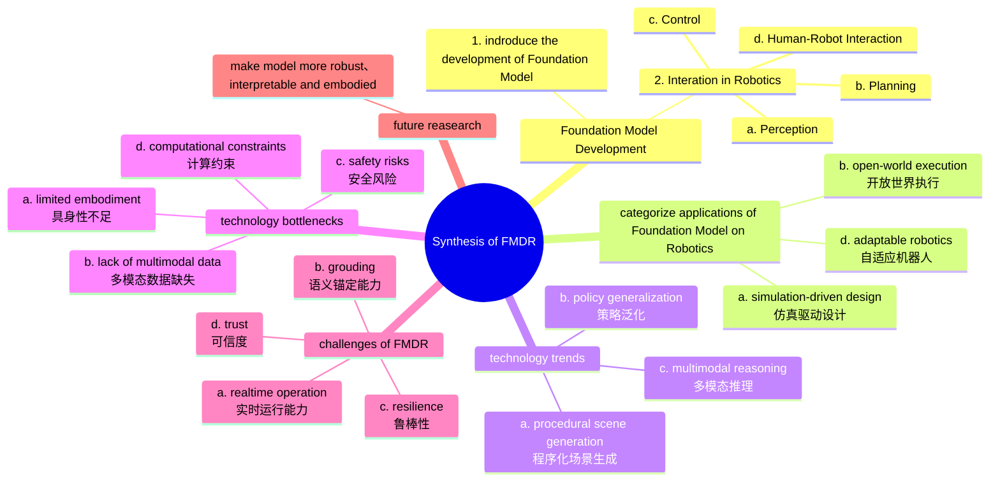

---
{"dg-publish":true,"permalink":"/学术研究/论文笔记/论文10-Foundation Model Driven Robotics-A Comprehensive Review/","tags":["AI","机器人"]}
---


# Abstract



# Content

## Integration in Robotics

机器人系统可以分解为**感知、规划、控制、人机**交互四个组成部分。

传统的方法主要依靠任务专用模型（task-specific models）实现四部分的功能，例如卷积网络用于物体检测、PID用于电机控制等等，存在泛化性（generalization）、适应性（adaptability）、语义锚定（Semantic Grounding，把抽象的指令、概念对应到机器人的具体执行上）。

而基础模型在这些问题上表现更好，对应到四个组成部分的功能如下图所示。


### Perception

基础模型能够基于文本描述和采集画面识别从未见过的新物体（在训练数据中未出现的），提升泛化性。

相关研究提出了触觉等其他传感器模态数据映射到多模态语义空间的方法，让机器人通过基础模型可以预测抓取的稳定性，或通过触感识别物体。

### Planning
 
传统规划器需要针对不同场景进行显式编程或大量任务专属训练。而基础模型能够对任务进行分解推理，生成动作序列，提升了泛化性。
 
SayCan 框架作为机器人可行性校验模型，能够对基础模型生成的动作进行物理约束校验（如机械臂路经点是否可达），提升语义锚定能力。

机器人可以使用大语言模型获取环境观测信息，并通过自然语言 “思考” 进行迭代重规划或自我修正，从而实现反馈闭环控制。

端到端具身大语言模型，能够接受文本/图像指令输入，直接输出机器人的控制信号。这种模型主要是用大量“指令->动作空间”数据训练而成的，训练数据例子如下。

```
例子1: 机械臂（抓取）
	指令：拿起桌上的杯子
	输入图像：桌上有杯子
	动作标签:末端执行器位姿、或6关节角度序列
例子2: 麦克纳姆轮底盘
	指令：向左平移到红色箱子旁边
	输入图像：机器人前方有红色箱子，在左侧
	动作标签:四轮速度：[0.2, 0.2, -0.2, -0.2]
```

### Control

用基础模型做机器人控制的三种方式：
+ **直接使用通用大模型/控制器**（Generalist Controller，如DeepMind 的 Gato）：直接使用大模型做策略网络（policy network，输入指令，输出动作），根据输入模态输出文本或扭矩指令。
+ **训练专用机器人端到端大模型**（VLA，Vision-Language-Action Model）：专门为机器人控制做过微调，泛化强，能处理训练没见过的物体。
+ **代码即策略**（Code as Policies）：让 LLM 实时生成机器人控制代码，调用 API / 运动基元完成任务，优点在于可解释性强、方便调试。


### Human-Robot Interaction

基础模型在人机交互方面的作用包括：
- **自然语言交互**：普通人用日常语言指挥机器人，不用专业编程，支持对话式迭代修改指令。
- **视觉 + 语言融合交互**：机器人能结合**看到的场景**回答问题、解释行为，交互更真实、透明。
- **常识与社交理解**：懂人类偏好、预判动作、遵守社交规范，交互更自然、人性化。
- **可解释、可调试**：机器人能说明 “为什么这么做”，提升信任度与安全性。
- **多模态统一理解**：未来可融合视觉、听觉、触觉、语言，实现类人场景理解。

### Challenges

基础模型带来机器人泛化性等方面提升的同时，也带来新的挑战，包括：
+ **安全性与可靠性不足**：模型会产生幻觉或给出错误指令，导致危险的动作，因此需要对其行为进行约束，例如限制 LLM 只能调用经过审核的 API / 运动基元，避免乱执行；其次可引入闭环反馈、人在回路监督等方式来进行提升。
+ **计算量大**：模型运行慢，难以满足机器人实时控制要求，目前业界主要尝试压缩模型，提高实时性，来适配机器人端部署。
+ **语义锚定不足**：语言和物理世界对应不准，机器人 “听懂但做不对”。目前可用的方法如价值函数、感知信息把语言绑定到真实物理世界。


# Reference

+ [论文地址](https://arxiv.org/html/2507.10087v1)
+ [论文分析1](https://blog.csdn.net/weixin_37990186/article/details/150018445)
+ [论文分析2](https://blog.csdn.net/weixin_39699362/article/details/149447886)
+ [机器人领域综述文章推荐](https://www.zhihu.com/question/355901283/answer/1977327866778767566)


