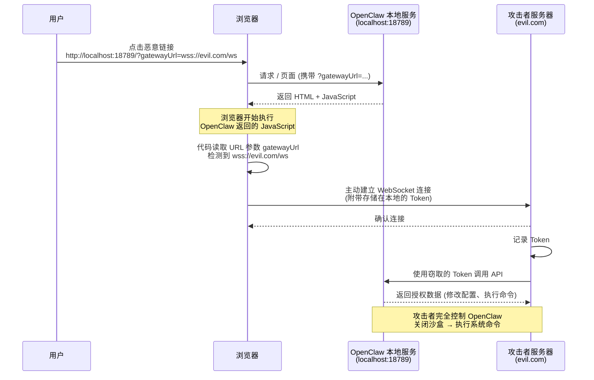

---
{"dg-publish":true,"permalink":"/计算机科学/人工智能/04. 高金OpenCraw安全讲座/"}
---

# 技术架构


# 安全问题

## 权限模型

+ 全盘读写权限；
+ 终端/Shell访问；
+ 浏览器访问；
+ Outh令牌

## CVE-2026-25253漏洞




+ OpenClaw 的 Web 控制台（openclaw图形管理界面）端口是固定、公开的默认值，即端口18789
+ openClaw 设计的`?gatewayUrl=ws://192.168.1.100:18789`的目的主要是为了一些开发者特殊场景，如在A机器有`http://127.0.0.1:18789`这个控制台UI，但是B机器上`http://192.168.1.100:18789`没有内置的页面，只是一个后端网关，这个时候就可以通过`http://127.0.0.1:18789?gatewayUrl=ws://192.168.1.100:18789`，利用A机器的控制台页面访问B机器的openclaw网关。漏洞的根因就是没有对`gatewayUrl`做参数检查。
+ 控制台页面在处理`gatewayUrl`的时候会把本地token发出去
  ```js
  // 读取 URL 参数中的 gatewayUrl
const gatewayUrl = new URLSearchParams(location.search).get('gatewayUrl');
if (gatewayUrl) {
    // 从 localStorage 或内存中取出存储的 Token
    const token = localStorage.getItem('gateway_token');
    // 主动向攻击者指定的服务器发起 WebSocket 连接，并在握手时携带 Token
    const ws = new WebSocket(gatewayUrl);
    ws.onopen = () => ws.send(JSON.stringify({ type: 'auth', token }));
}
  ```
+ 在websocket连接建立之后，攻击者会通过浏览器作为通道，调取本地openclaw的接口，比如向受害者的浏览器发送一条消息`{"action": "callApi", "endpoint": "/v1/chat/completions", "payload": {...}}`

## 攻击模型


## AI代码

两机同步代码，如果一台关机了，代码逻辑会错认为这台机子上的数据都删除了，然后就会在另一台机子上做数据删除动作。


# 安全加固


+ Docker容器安装；


